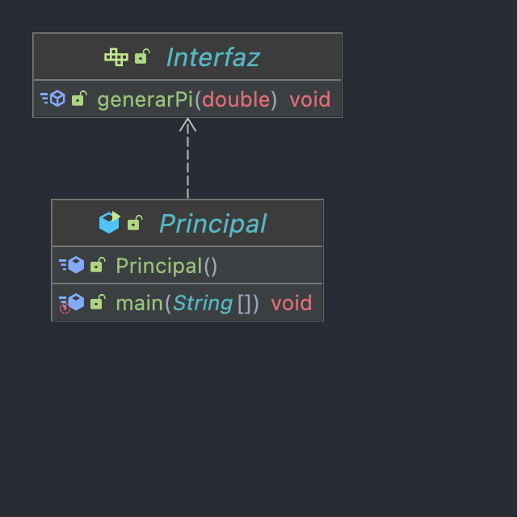

Copyright [2022] [Daniel Fernández López]
Licensed under the Apache License, Version 2.0 (the "License");
you may not use this file except in compliance with the License.
You may obtain a copy of the License at

    http://www.apache.org/licenses/LICENSE-2.0

Unless required by applicable law or agreed to in writing, software distributed
under the License is distributed on an "AS IS" BASIS, WITHOUT WARRANTIES OR CONDITIONS
OF ANY KIND, either express or implied. See the License for the specific language governing
permissions and limitations under the License.

# MonteCarloLambda2022

## Descripción:

Este programa ha sido diseñado para poder realizar una aproximación al número Pi a partir del método de Monte Carlo
aplicando expresiones Lambda.

Las expresiones lambda son funciones anónimas, es decir, funciones que no necesitan una clase.
En este caso hemos implementado este tipo de funciones junto a una interfaz funcional, las cuales tienen un método a implementar,
es decir, un método abstracto. Una interfaz funcional define objetos que no guardan valores como los objetos tradicionales sino 
que sirven para guardar funciones.

El método de Monte Carlo consiste en inscribir una circunferencia dentro un cuadrado, (siendo el diámetro de la circunferencia
igual que uno de los lados del cuadrado) y mediante la generación de puntos aleatorios sobre la superficie dibujada se establece
una relación entre los puntos interiores (aciertos) y puntos totales; con la que se podrá llevar a cabo la aproximción al número Pi.

En este programa hemos definido tres variables:
- n: puntos que quedan por tirar.
- d: número de aciertos, es decir, cuantos puntos caen dentro de la circunferencia.
- intentos: número de puntos a tirar.

## Comandos:

* Ejecución código:
```shell
java -jar ap-Matematicas.jar X 
```

Donde X determina el número de intentos, por ejemplo 1000.
Aunque también es posible ejecutar el programa mediante el comando:

```shell
make ejecutar
```

* Compilación código:
```shell
make compilar
```

* Creación jar:
```shell
make jar 
```

* Creación Javadoc:
```shell
make javadoc
```
## Diagrama:


